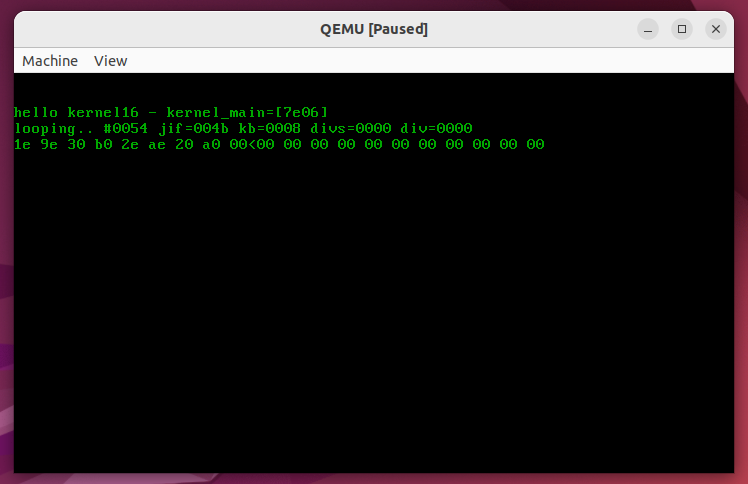

# MyOS
A very simple, self-teaching, educational operating system.

Copyright (C) Nicolas Sauzede 2009.

# How to test it
Required tools: qemu-system-i386, nasm, gcc and make (and optionally gdb for debug)
Note that "gcc-multilib" might also be needed to build 32-bit binaries.

Run the 16-bit kernel as a floppy boot sector:
```
$ make check
```
You should see this after typing 'abcd' (0x1e, 0x30, 0x2e, 0x20) on the keyboard:


Debug the 16-bit boot part nicely in real-mode:
```shell
$ make check_dbg
...
real-mode-gdb$ tb *0x7c00
Temporary breakpoint 1 at 0x7c00
real-mode-gdb$ c
```
You should then see the first instructions of the 16-bit loader:
```
---------------------------[ CODE ]----
=> 0x7c00:      cli
   0x7c01:      push   cs
   0x7c02:      pop    ds
```

# About the project

Some parts inspired on SOS : (another educational operating system)
http://sos.enix.org/

This project was started to learn by myself how operating systems are
written and work at their lowest level.
It is focused mainly on intel x86 architecture.

KEYWORDS : os boot loaders, 16/32 bit assemby, real/protected mode,
segmentation, interrupts, multi-tasking, etc..

Basically composed of x86 code, comprising a bootloader and a kernel
(well two in fact).

The main target is emulation via qemu, as a bios rom extension or a 
bootable floppy disk image.
But it should also run as well on a real machine.

-the loader is a nasm x86 assembly code, bootstrapping 16/32 bit kernels.
-the 16 bit kernel is pure nasm 16 bit real mode code.
-the 32 bit kernel is plain ANSI C code, running in 32 bit protected mode,
with one small gas assembly start code.

See doc/specs.txt for more technical details / general low level OS infos.

The code should normally be quite portable and build under both windows and linux, thanks to
some trickery concerning some asm symbol names, as inspired by this post :
http://stackoverflow.com/questions/1034852/adding-leading-underscores-to-assembly-symbols-with-gcc-on-win32

Developped and released under GPLv2+ license (see LICENSE file)
